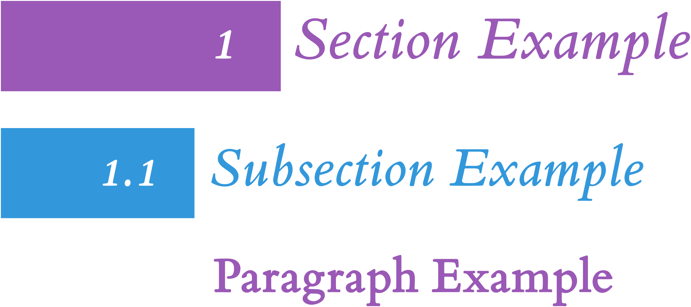
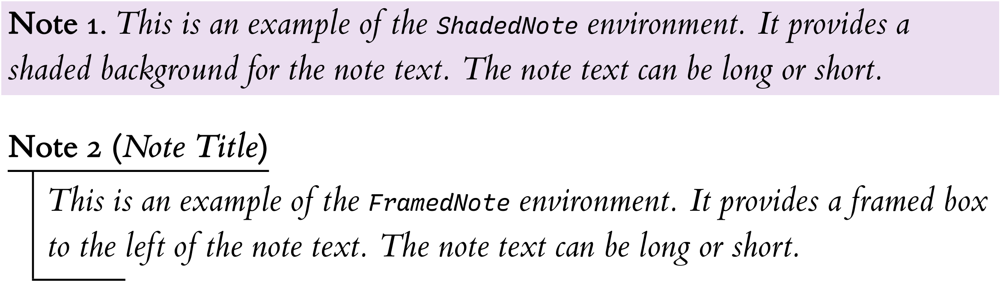
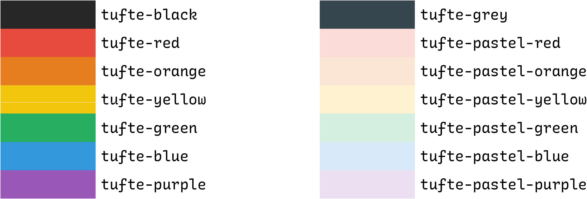

<a id="readme-top" aria-label="Anchor to beginning of the document"></a>

# Modernized Tufte-LaTeX
[](https://opensource.org/licenses/Apache-2.0)

This repository contains a modernized fork of the Tufte-LaTeX classes.
They have been modernized to support modern LaTeX engines, and customized to fit my personal needs and preferences.
The original classes can be found at [Tufte-LaTeX](https://github.com/Tufte-LaTeX/tufte-latex "Tufte-Latex git repository"),
with the original documentation available at [Tufte-LaTeX Documentation](https://tufte-latex.github.io/tufte-latex/ "Tufte-LaTeX Documentation").
Additionally it borrows good work from [fork](https://github.com/chriskgrant/tufte-latex "Tufte-LaTeX fork")
by [Chris K. Grant](https://github.com/chriskgrant "Chris K. Grant's GitHub page").
As well as from [fork](https://github.com/mattyizhengHe/Customized-TufteHandout-Latex "Customized-TufteHandout-Latex")
by [Matthew Y. He](https://github.com/mattyizhengHe "Matthew Y. He's GitHub page").

The main changes are:
- Adds a `makefile` to compile the document.
  - This can be used to install the classes on local system, or compile all or individual `.tex` files in the directory.
  - Fixes issue in `makefile` so it doesn't compile `tufte local` files.
- Fixes issue where caption alignment was not affected by `raggedouter` option when `twoside` was used.
- Replaces `natbib` and `bibtex` with `biblatex` and `biber` for bibliography.
  - This change breaks vertical offset argument in `\cite` command, as `biblatex` uses its own arguments in `\cite`.
- Adds support for `xelatex` and `lualatex` engines.
  - Uses `iftex` to determine which TeX engine is being used.
  - Fixes font and letterspacing handling for `XeLaTeX` and `LuaLaTeX`.
-  Uses `fontspec` package to load fonts in `XeLaTeX` and `LuaLaTeX` engines.
  - Uses the `ETbb` package if installed for Edward Tufte's Bembo font.
  - Uses the `gillius` package if installed for Gill Sans font is sans serif sections.
  - Uses the `fira` package if installed for Fira Mono font in code blocks.
    - This is optionally overridden with the Recursive Mono font located in `fonts/recursive-mono`.
    - It uses the `custom-tufte-common.tex` file to achieve it.
- Updates the `tufte-handout` class with:
  - Decorated paragraphs and (sub)sections with colors and numbered boxes.
    - This can be disabled with `nomoderntitles` option.
  - Adds `ShadedNote` and `FramedNote` environments for notes.
  - Uses `cleveref` package for references.
    - Adds support for referencing note environments with `\cref` command.
    - Additionally loads the `amsmath`, `amssymb`, and `amsxtra` packages to avoid conflicts with `cleveref`.
  - Adds predefined colors for use in documents.
- Updates the `tufte-book` and `tufte-handout` classes to support modern LaTeX features.

This project exists because development on Tufte-LaTeX classes has been stagnant for a while.
The last development and release was in 2015, with 4 more years of spelling fixes.
I wanted to keep them updated and easy to use in modern LaTeX environments.
Additionally I used it as a learning experience and as a way to customize it further to my needs.

<details>
  <summary>Table of Contents</summary>

1. [Modernized Tufte-LaTeX](#modernized-tufte-latex)
1. [Background](#background)
1. [Usage](#usage)
   1. [Base TeX File](#base-tex-file)
   1. [Class Options](#class-options)
1. [Extra Features](#extra-features)
   1. [Colored Sections and Paragraphs](#colored-sections-and-paragraphs)
   1. [Note Environments](#note-environments)
   1. [Predefined Colors](#predefined-colors)
   1. [Different Code Block Fonts](#different-code-block-fonts)
1. [Dependencies](#dependencies)
1. [Installation](#installation)
1. [Local Development](#local-development)
   1. [Code Editor](#code-editor)
   1. [Compiling](#compiling)
1. [Troubleshooting](#troubleshooting)
1. [Roadmap](#roadmap)
1. [Bugs/Features/Support](#bugsfeaturessupport)
1. [Contributing](#contributing)
1. [Contact](#contact)
1. [Acknowledgements](#acknowledgements)
1. [License](#license)
</details>

<p align="right">(<a href="#readme-top" aria-label="Link to the top of the document">Back to top</a>)</p>

# Background
The Tufte-LaTeX classes define a style similar to the Edward Tufte's style.
He uses a style known for its:
- Extensive use of sidenotes, to provide relevant information outside main text.
- Tight integration of graphics with text to aid comprehension & understanding.
- A well-set typography which provides a clean and easy to read document.

These classes attempt to replicate this style in LaTeX, and make it easy to use.
One class emulate his book style, while the other emulates his handout style.
They are very creatively named `tufte-book` and `tufte-handout` respectively.

This project itself is my attempt at keeping these updated, with extra flare.
I am using this as an exercise in LaTeX tinkering and as a way to keep notes.
Changes made are motivated by my needs to make the text more readable for me.
I hope that others may find it useful as well.
If not, the major change of adding colored headings and paragraphs can be disabled with `nomoderntitles` option.

For more information please refer to the sample [book](out/sample-book-lualatex.pdf "Sample Book render")
and [handout](out/sample-handout-lualatex.pdf "Sample Handout render") documents.
They provide a good overview of the features of the classes.
Additionally you can refer to the original [Tufte-LaTeX Documentation](https://tufte-latex.github.io/tufte-latex/ "Tufte-LaTeX Documentation"),
Although, link rot and lack of maintenance seem to have taken their toll.
Therefore the samples given here try to be comprehensive and self-sufficient.

<p align="right">(<a href="#readme-top" aria-label="Link to the top of the document">Back to top</a>)</p>

# Usage
This project provides two classes:
- [`tufte-book`](./tufte-book.cls) for books.
- [`tufte-handout`](./tufte-handout.cls) for handouts.

The classes can be used as follows:

```latex
\documentclass{tufte-book}
% or
\documentclass{tufte-handout}
```

They come packed with a number of great features and customization options.
As mentioned in the [Background](#background) section, see the sample documents for details.
A quick summary of available customizations see the [Class Options](#class-options) section.

## Base TeX File
You can quite easily re-use the [sample book](sample-book.tex "Sample Book source file")
or [sample handout](sample-handout.tex "Sample Handout source file") files.
They provide a good starting point for your own documents.
They also use a [sample bibliography](sample.bib "Sample bibliography file")
file, which you can use as a template.

The pre-amble of each of these LaTeX files marks which packages and commands are used only for the sample.
These are marked in section demarkated by `These can be removed in actual documents, only used for examples` comment.
You can simply remove those and start with clean slate containing only necessary packages and commands.

Additionally I have provided a [custom-tufte-common.tex](custom-tufte-common.tex "The custom-tufte-common file"),
which shows how you can override font settings.
If you don't want to use it, you can remove it or replace it with your own packages, commands, and settings.

In case you are not interested in the sample files you can use minimal example below:
<details>
  <summary>Minimal tufte-handout document setup</summary>

```latex
\documentclass{tufte-handout}

\title{Your Title}
\author{Your Name}
\date{2025-03-01} % /optional/, sets document date, uses \today if omitted

\addbibresource{your-bibliography.bib} % /optional/, used for bibliography

\begin{document}

\maketitle

\begin{abstract} % /optional/, creates an abstract
  Your abstract goes here.
\end{abstract}

% Your content goes here

\printbibliography[heading=bibnumbered] % /optional/, prints bibliography if used

\end{document}
```
</details>
ㅤㅤ  

For books you can use this minimal example:
<details>
  <summary>Minimal tufte-book document setup</summary>

```latex
\documentclass{tufte-book}

\renewcommand*{\blankpagetext}{This page intentionally contains only this sentence.} % /optional/, sets text for blank pages

\title{Your title}
\author{Your name}
\publisher{Your publisher} % /optional/, sets publisher name
\date{2025-03-01} % /optional/, sets document date, uses \today if omitted

\usepackage{makeidx} % /optional/, used for index
\makeindex

\addbibresource{your-bibliography.bib} % /optional/, used for bibliography

\begin{document}

\frontmatter % See `sample-book.tex` for example of things to include in frontmatter

\tableofcontents

\listoffigures % /optional/, used for list of figures

\listoftables % /optional/, used for list of tables

\mainmatter

% Your content goes here

\backmatter

\printbibliography % /optional/, prints bibliography if used

\printindex % /optional/, prints index if used

\end{document}
```
</details>

## Class Options
The Tufte-LaTeX classes provide a number of options to customize the document.
These options are:
- Paper Size and Layout Options:
  - `a4paper` -- sets the paper size to A4, instead of default letter size
  - `b5paper` -- sets the paper size to B5, instead of default letter size
  - `twoside` -- alternates page heads position on recto/verso pages
  - `symmetric` -- put marginal material on the outside edge of the page, instead of the default right side, forces `twoside` on
- Font and Text Options:
  - `sftitle` -- sets title page or block, as well as abstract and epigraphs, in sans serif typeface (*default in book*)
  - `nosftitle` -- sets title page or block, as well as abstract and epigraphs, in serif typeface (*default in handout*)
  - `sfmarginals` -- typesets all marginals in sans serif typeface
  - `justified` -- sets main content to fully justified layout, flush left and right, instead of the default ragged right
  - `nofonts` -- doesn't load any fonts
  - `nols` -- doesn't configure letterspacing
  - `nonotes` -- doesn't configure ShadedNote and FramedNote environments
  - `bidi` -- loads the `bidi` package for bi-directional text
- Title Page Options:
  - `notitlepage` -- creates only a title block with \maketitle (*default in handout*)
  - `titlepage` -- creates a full title page with \maketitle (*default in book*)
- Toggle Options:
  - `nobib` -- doesn't load Biblatex or adjust the \cite command
  - `notoc` -- suppresses the Tufte-Style table of contents
  - `nohyper` -- suppresses loading of the hyperref package
  - `nomoderntitles` -- keeps old style of section and paragraph titles instead of the modern style
- Following options set text layout for marginal materials.
  These materials are:, `sidenote`, `marginnote`, `caption`, and `citation`.
  The `marginals` option is a shortcut to apply layout settings to all marginal material.
  - `justified` -- fully justified text, flush left and right
  - `raggedleft` -- sets the text ragged left, regardless of which page it's on
  - `raggedright` -- sets the text ragged right, regardless of which page it's on
  - `raggedouter` -- sets the text ragged left on verso pages and ragged right on recto pages, useful for `symmetric` layout
  - `auto` -- justifies text if document class is justified, otherwise it's set to the ragged right
- Debugging Options:
  - `debug` -- provides more information in the .log file for use in troubleshooting problems, prints value of each option in log

For more information about options refer to the [sample book](out/sample-book-lualatex.pdf "Sample Book render")
and corresponding source file: [sample-book.tex](sample-book.tex "Sample Book source file").
This document provides a comprehensive overview of the features of the classes.

For example you can set handout to use A4 paper, use symmetric layout, and align margin elements to the outer edge:

```latex
\documentclass[a4paper,symmetric,marginals=raggedouter]{tufte-handout}
```

<p align="right">(<a href="#readme-top" aria-label="Link to the top of the document">Back to top</a>)</p>

# Extra Features
In addition to the original features, this project adds a few more.
As mentioned earlier these mainly apply only to the `tufte-handout` class.
They are based on changes made by [Matthew Y. He](https://github.com/mattyizhengHe "Matthew Y. He's GitHub page").

## Colored Sections and Paragraphs
Matthew Y. He added colors to paragraphs and (sub)sections.
In addition he added boxes with (sub)section numbers to the left of the title.
I kept the boxes, but changed the colors.
I also moved the functionality to the `tufte-handout` class.
While colors are defined in the `tufte-common.def` file.
No action is needed to use this feature, styling is applied automatically.
It can be disabled with the `nomoderntitles` option.

Here is an example of colored sections and paragraphs:


To add your own tweaks, you can go to the [`tufte-handout.cls`](tufte-handout.cls "The tufte-handout class definition")
In this section you can change the colors, styling, spacing and much more.

There is one problem with this feature, if (sub)section is not numbered the title will overlap with the colored box.
I haven't found a way to fix it yet, I am open to suggestions.
In meantime ensure every (sub)section is numbered, also use the `bibnumbered` option in `\printbibliography` command.

## Note Environments
Matthew Y. He added several theorem environments.
I found them useful, however I felt like there were too many of them.
Hence I kept only two and modified them slightly, these are: `ShadedNote` and `FramedNote`.
You can use them to emphasize text on the page with important information.

It is especially useful when you wish to refer back to this information later.
As it allows for referencing the note environments with the `\cref` command.
Additionally you can expand on the note at a later date and it will nicely linked back to the original note.

If you go to the [`tufte-handout.cls`](tufte-handout.cls "The tufte-handout class definition")
file you can see their definitions, tweak them, add more, or remove them completely.

For example to create a simple shaded note use the following code:

```latex
\begin{ShadedNote}[%
  name={Optional Note Title},%
  label={nt:optional-note-label},%
  continues={nt:optional-preceding-note-label}%
]
  Note content goes here.
\end{ShadedNote}
```

And here is a preview of the note environments:



## Predefined Colors
Tufte-LaTeX classes now define a number of colors which are used in classes and samples.
These can also be used by the user to color text or background.
Color names are prefixed with `tufte-` to avoid conflicts with regular colors, not because E. Tufte used these colors.
The colors are defined in the `tufte-common.def` file, with following values:

```latex
\definecolor{tufte-black}{HTML}{282828}
\definecolor{tufte-grey}{HTML}{F6F6F6}
\definecolor{tufte-white}{HTML}{FFFFFF}
\definecolor{tufte-red}{HTML}{E74C3C}
\definecolor{tufte-pastel-red}{HTML}{FADBD8}
\definecolor{tufte-orange}{HTML}{E67E22}
\definecolor{tufte-pastel-orange}{HTML}{FAE5D3}
\definecolor{tufte-yellow}{HTML}{F1C40F}
\definecolor{tufte-pastel-yellow}{HTML}{FCF3CF}
\definecolor{tufte-green}{HTML}{27AE60}
\definecolor{tufte-pastel-green}{HTML}{D4EFDF}
\definecolor{tufte-blue}{HTML}{3498DB}
\definecolor{tufte-pastel-blue}{HTML}{D6EAF8}
\definecolor{tufte-purple}{HTML}{9B59B6}
\definecolor{tufte-pastel-purple}{HTML}{EBDEF0}
```

Here is a preview of these colors:


As before you can chose to use these colors, modify them, or remove them completely.
However note that these colors are used in classes, so you will have to replace them with other colors if you remove them.

This is change that applies to both `tufte-book` and `tufte-handout` classes.

## Different Code Block Fonts
The classes by default try to use the `Fira Mono` font from the [`fira` package](https://www.ctan.org/pkg/fira "Fira Package Homepage")
for code blocks.
If this font is unavailable it will fall back on the `TeX Gyre Cursor` from the 
[`tex-gyre-cursor` package](https://www.ctan.org/pkg/tex-gyre-cursor "TeX Gyre Cursor Package Homepage").
If compiling with `pdfLaTeX` it will fall back on the default `Computer Modern` font if `Fira Mono` is unavailable.

However I prefer to use my own flavor of the [`Recursive` font](https://www.recursive.design/ "Recursive Font Homepage").
It is customized to my liking and patched with [`Nerd Fonts` icons](https://www.nerdfonts.com/ "Nerd Fonts Homepage").
As it is not available online, it is included in the `fonts/recursive-mono` dir.
Not everyone will want it, therefore it is enabled within the
[`custom-tufte-commmon.tex` file](custom-tufte-common.tex "The custom-tufte-common file").
You can remove this section from the file, or replace it with your own font.
You can read more about `custom-tufte-...` files and how they are used in the
[tufte book sample](samples/sample-book-lualatex.pdf "Sample Book render").

<p align="right">(<a href="#readme-top" aria-label="Link to the top of the document">Back to top</a>)</p>

# Dependencies
You need to have a working TeX distribution to compile the documents.
The most popular distributions are:
- [TeX Live](https://www.tug.org/texlive/ "TeX Live Homepage")
- [MacTeX](https://www.tug.org/mactex/ "MacTeX Homepage")
- [MiKTeX](https://miktex.org/ "MiKTeX Homepage")

I have only tested it with TeX Live, but it should work with the others as well.
Just make sure that your system has the following terminal utilities:

- `make` (**optional** for compiling with the provided [makefile](makefile "The makefile"))
- `latexmk` (for compiling documents either manually or with makefile)
- `biber` (for bibliography support)
- `texhash` (**optional** for updating the TeX database when installing the classes)

Additionally the Tufte-LaTeX classes require the following packages:

- `amsmath` * *for `Note` environments*
- `amssymb` * *for `Note` environments*
- `amsthm` * *for `Note` environments*
- `amsxtra` * *for `Note` environments*
- `biblatex` * *only if `nobib` is off, requires `biber` backend*
- `bidi` * *only if using `bidi` option*
- `changepage`
- `chngpage` * *only if `changepage` is not available*
- `cleveref` * *for `Note` environments*
- `ETbb` * *if available, and `nofonts` is off*
- `fancyhdr`
- `FiraMono` * *if available, and `nofonts` is off*
- `fontenc` * *only with pdfLaTeX, and `nofonts` is off*
- `fontspec` * *only with XeLaTeX or LuaLaTeX, and `nofonts` is off*
- `geometry`
- `gillius2` * *if available, and `nofonts` is off*
- `hardwrap`
- `hyperref` * *only if `nohyper` is off*
- `iftex` * *if not available it will assume document is compiled with pdfLaTeX*
- `letterspace` * *only if `nols` is off*
- `mathpazo` * *if available, and `nofonts` is off*
- `multicol`
- `optparams`
- `paralist`
- `placeins`
- `ragged2e`
- `sectsty`
- `setspace`
- `soul` * *only with pdfLaTeX*
- `textcase`
- `textcomp` * *only with pdfLaTeX, and `nofonts` is off*
- `thmtools` * *for `Note` environments*
- `titlesec`
- `titletoc`
- `transparent`
- `xcolor`
- `xifthen`
- `xkeyval`

Depending on what LaTeX distribution, you may need to install these packages.
Some distributions support automatic download.
Refer to your distribution's documentation for more information.

Rendering has been tested on a GNU/Linux system with a TeX Live distribution.
It should work on other systems as well, but I have not tested it.
Mainly because I don't have a Mac, and refuse to use Windows even on pain of death.

<!--
I'd just like to interject for a moment.
What you're refering to as Linux, is in fact, GNU/Linux, or as I've recently taken to calling it, GNU plus Linux.
Linux is not an operating system unto itself, but rather another free component of a fully functioning GNU system made useful by the GNU corelibs, shell utilities and vital system components comprising a full OS as defined by POSIX.

Many computer users run a modified version of the GNU system every day, without realizing it.
Through a peculiar turn of events, the version of GNU which is widely used today is often called Linux, and many of its users are not aware that it is basically the GNU system, developed by the GNU Project.

There really is a Linux, and these people are using it, but it is just a part of the system they use.
Linux is the kernel: the program in the system that allocates the machine's resources to the other programs that you run.
The kernel is an essential part of an operating system, but useless by itself; it can only function in the context of a complete operating system.
Linux is normally used in combination with the GNU operating system: the whole system is basically GNU with Linux added, or GNU/Linux.
All the so-called Linux distributions are really distributions of GNU/Linux!
-->

<p align="right">(<a href="#readme-top" aria-label="Link to the top of the document">Back to top</a>)</p>

# Installation
If you're using TeX Live on GNU/Linux, you should be able to run `make install`.
This make target will install the Tufte-LaTeX classes and make them available on your system.

Otherwise, you can install the classes by manually copying the files to the appropriate directories.
Find your `TEXMFHOME` directory by running `kpsewhich -var-value TEXMFHOME`.
Then copy the files to the appropriate subdirectory of your `TEXMFHOME` directory.
At minimum you need to copy the following files: `tufte-common.def`, `tufte-book.cls`, and `tufte-handout.cls`.
A good place to put them is `$TEXMFHOME/tex/latex/tufte-latex`.
After copying the files, run `texhash` to update the TeX database.
Study the make target to see what additional files are copied for full installation with documentation and other files.

The [makefile](makefile "The makefile") also provides a `make uninstall` target to remove the classes from your system.
This will remove the files from the `TEXMFHOME` directory and run `texhash` to update the TeX database.
In case of updates or changes to the classes, you can run `make update` to remove the classes and install them again.

In case you use Tufte-LaTeX locally with copy these files to document's working directory.
Then either compile the document manually or with the provided [makefile](makefile "The makefile").

<p align="right">(<a href="#readme-top" aria-label="Link to the top of the document">Back to top</a>)</p>

# Local Development
## Code Editor
You can use any text editor you like to edit the LaTeX files.
It's best to use one that supports LaTeX natively or with plugins.
I personally prefer using [Visual Studio Code](https://code.visualstudio.com/ "Visual Studio Code Homepage")
with the [LaTeX Workshop](https://marketplace.visualstudio.com/items?itemName=James-Yu.latex-workshop "LaTeX Workshop Extension"),
or [Doom Emacs](https://github.com/doomemacs/doomemacs "Doom Emacs Homepage")
with the `latex` module.

You can use any other editor, or if you prefer use online solutions like [Overleaf](https://www.overleaf.com/ "Overleaf Homepage").

Most importantly use what's most comfortable for you.

## Compiling
You can compile the Tufte-LaTeX files with following TeX engines:
- [LuaLaTeX](https://www.luatex.org/ "LuaLaTeX Homepage")
- [XeLaTeX](https://tug.org/xetex/ "XeLaTeX on TUG")
- [pdfLaTeX](https://www.tug.org/applications/pdftex/ "pdfLaTeX on TUG")

As mentioned before you can use the provided [makefile](makefile "The makefile")
to compile the sample documents with `make compile-lua`, `make compile-xe`, or `make compile-pdf`.
In case of single files use the `make compile-only FILE="<file>.tex"` target.
This will use the `LuaLaTeX` engine, however you can change the target to use any engine you like.
I would recommend changing the `-outdir=samples` to a directory of your choice, for example: `-outdir=out`.

Cleaning up the auxiliary files can be done with `make clean`.
If you want to get rid of both auxiliary files and compiled PDFs use `make clean-all`.

For simplicity here is the minimal makefile without install related commands, using only `LuaLaTeX` engine.
You can use it in your projects to compile the documents, even if they use different classes.
If needed you can change the engine to `XeLaTeX` or `pdfLaTeX` by changing the `-lualatex` option to `-xelatex` or `-pdflatex`.

<details>
  <summary>Simplified makefile for general use</summary>

```make
LMKFLAGS = -outdir=out -auxdir=aux -bibtex

compile-all:
	latexmk $(LMKFLAGS) -lualatex -jobname=%A-lualatex \
	$(shell find . -maxdepth 1 -name '*.tex' -not -path '*/custom-tufte-*')

compile-only:
	if [ -z "$(FILE)" ]; then \
		echo "You need to provide a FILE parameter when using this target"; \
		echo "make compile-only FILE=\"<file>.tex\""; \
	else \
		latexmk $(LMKFLAGS) -lualatex -jobname=%A "$(FILE)"; \
	fi

clean:
	rm -rfv aux

clean-all:
	rm -rfv aux out
```

</details>

You can also compile the documents with `latexmk`.
To use `latexmk`, substituting `ENGINE` with preferred engine, and `SOURCE.tex` with the name of your source file.
```shell
latexmk -outdir=out -auxdir=aux -bibtex -ENGINE -jobname=%A-lualatex SOURCE.tex
```

You could also do things manually.
For files using the `tufte-handout` class, you should do something like this:
```shell
lualatex  SOURCE.tex
biber     SOURCE
lualatex  SOURCE.tex
lualatex  SOURCE.tex
```

For files using the `tufte-book` class, you might do something like:
```shell
lualatex  SOURCE.tex
biber     SOURCE
makeindex SOURCE.idx
lualatex  SOURCE.tex
lualatex  SOURCE.tex
lualatex  SOURCE.tex
```

<p align="right">(<a href="#readme-top" aria-label="Link to the top of the document">Back to top</a>)</p>

# Troubleshooting
If you encounter errors of the form of:
```
! LaTeX Error: File `paralist.sty' not found.
```

You need to install the missing package.
Either use your distribution to get them, or download them from [CTAN](http://ctan.org "The CTAN Homepage")
and install them manually.

More info on common issues can be found in the [sample book](out/sample-book-lualatex.pdf "Sample Book render")
and corresponding source file: [sample-book.tex](sample-book.tex "Sample Book source file").

<p align="right">(<a href="#readme-top" aria-label="Link to the top of the document">Back to top</a>)</p>

# Roadmap
Here is a general roadmap of the project:

- [x] Move features from other repos to class files
- [x] Document new features
- [x] Point people to use discussions on GitHub
- [ ] Create a github.io page for the project
  - [ ] Link to the page in sample documents
- [x] Improve documentation in:
  - [x] Readme
  - [x] Sample documents
    - [x] Book
    - [x] Handout
  - [x] Class files
  - [x] Common file
- [x] Rename `tufte-X-local.tex` files to `custom-tufte-X.tex`, making their intent clearer
- [x] Document new `sftitle` option in `tufte-book` and readme
- [x] Document `blankpagetext` option in `tufte-book` and readme
- [x] Inform of problem with cref and (sub)section numbers in `tufte-book`
  - [x] This issue was fixed so it is no longer relevant
- [ ] Publish changes in a new release
- [ ] Publish on CTAN *maybe*
  - [ ] Pipeline to build realeases and prep package for CTAN
  - [ ] Add badge with package version to the readme
- [x] Add feature to disable colored sections and paragraphs with an option switch
- [x] Add feature to disable note environments with an option switch

If you have any suggestions or feature requests, please open an issue on the issue tracker.
I will try to address them as soon as possible.
However, I can't promise anything, as this is a side project, my knowledge of LaTeX is limited, and I don't have much spare time.

<p align="right">(<a href="#readme-top" aria-label="Link to the top of the document">Back to top</a>)</p>

# Bugs/Features/Support
There are some bugs or quirks that I am aware of:

- The `\cite` command no longer supports vertical offset.
  - This is because `biblatex` uses its own arguments in `\cite` command.
  - I will not fix this, as `biblatex` arguments are more useful, and you can offset other overlaping elements.
- When referencing an item placed in sidenote---like a figure or table---using the `\cref` command, the reference will link to section where the sidenote is placed.
  - I think this has something to do with the way marginal material and its captions/labels are handled.
  - I don't know how to fix this, I am open for suggestions on possible solutions or ideas as to why it's not working properly.
  - References to things in main text work just fine.
- In `tufte-handout` sections must be numbered or the title overlaps with colored box.
  - This is most visible in case of Reference/Bibliography section, as by default it is unnumbered.
  - My simple fix is to make every section numbered, but this might not be ideal for everyone.
  - You can make Biblio section numbered with `\printbibliography[heading=bibnumbered]` option.
  - I wasn't able to provide different styling for numbered and unnumbered sections, as I don't know how to do it.

See the [open issues](https://github.com/MormonJesus69420/Modernized-Tufte-LaTeX/issues)
for a full list of proposed features (and known issues).

<p align="right">(<a href="#readme-top" aria-label="Link to the top of the document">Back to top</a>)</p>

# Contributing
I welcome both contributions, suggestions, bug reports, and pull requests.
Please open an issue on the issue tracker, or submit a pull request.
Keep in mind that this is a side project, though I will try to address everything in a timely fashion.

I greatly appreciate any help, and feedback you can provide.

<p align="right">(<a href="#readme-top" aria-label="Link to the top of the document">Back to top</a>)</p>

# Contact
The project is maintained by [Daniel Aaron Salwerowicz](https://github.com/MormonJesus69420 "My GitHub page").
You can reach out to me by opening an issue, or starting a discussion on this GitHub page.
If you want a more private alternative you can send me an email at: [daniel@salwerowi.cz](mailto:daniel@salwerowi.cz).

<p align="right">(<a href="#readme-top" aria-label="Link to the top of the document">Back to top</a>)</p>

# Acknowledgements
I would like to thank the original authors of the Tufte-LaTeX classes:
[Kevin Godby](https://github.com/godbyk "Kevin Godby's GitHub page"),
[Bil Kleb](https://github.com/kleb "Bil Kleb's GitHub page"), and Bill Wood.

As well as [Chris K. Grant](https://github.com/chriskgrant "Chris K. Grant's GitHub page")
and [Matthew Y. He](https://github.com/mattyizhengHe "Matthew Y. He's GitHub page")
who have made changes to the classes that I found useful and have incorporated into this project.

<p align="right">(<a href="#readme-top" aria-label="Link to the top of the document">Back to top</a>)</p>

# License
Copyright 2007–2019 by Kevin Godby, Bil Kleb, and Bill Wood.  
Copyright 2025-... by Daniel Aaron Salwerowicz (only to the changes made by me).

Licensed under the Apache License, Version 2.0 (the "License");  
you may not use this file except in compliance with the License.  
You may obtain a copy of the License at

    http://www.apache.org/licenses/LICENSE-2.0

Unless required by applicable law or agreed to in writing, software  
distributed under the License is distributed on an "AS IS" BASIS,  
WITHOUT WARRANTIES OR CONDITIONS OF ANY KIND, either express or implied.  
See the License for the specific language governing permissions and  
limitations under the License.

<p align="right">(<a href="#readme-top" aria-label="Link to the top of the document">Back to top</a>)</p>