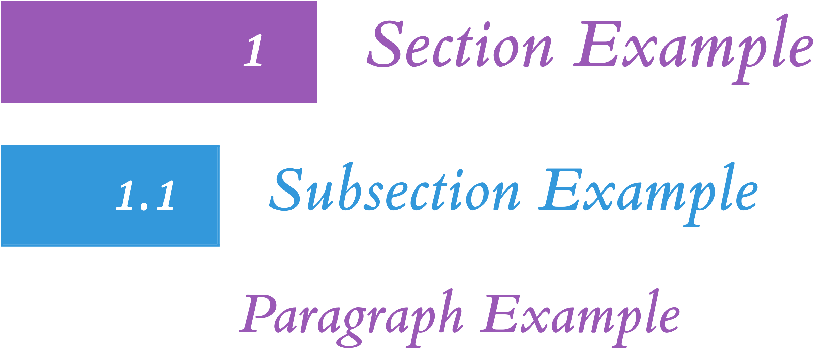

<a id="readme-top" aria-label="Anchor to beginning of the document"></a>

# Modernized Tufte-LaTeX
This repository contains a fork of the Tufte-LaTeX classes.
They have been customized to fit my personal preferences.
The original classes can be found at [Tufte-LaTeX](https://github.com/Tufte-LaTeX/tufte-latex "Tufte-Latex git repository"),
with the original documentation available at [Tufte-LaTeX Documentation](https://tufte-latex.github.io/tufte-latex/ "Tufte-LaTeX Documentation").
Additionally it borrows a lot from [fork](https://github.com/chriskgrant/tufte-latex "Tufte-LaTeX fork")
by [Chris K. Grant](https://github.com/chriskgrant "Chris K. Grant's GitHub page").
As well as from [fork](https://github.com/mattyizhengHe/Customized-TufteHandout-Latex "Customized-TufteHandout-Latex")
by [Matthew Y. He](https://github.com/mattyizhengHe "Matthew Y. He's GitHub page").

[//]: # (TODO: Fix this list, make it more exhaustive and detailed)
The main changes are:
- Added a `makefile` to compile the document.
  - Fixed issue in `makefile` so it doesn't compile `tufte local` files.
- Replace `natbib` and `bibtex` with `biblatex` and `biber` for bibliography.
  - That breaks vertical offset argument in `\cite` command, as `biblatex` also uses optional arguments in `\cite`.
- Added support for `xelatex` and `lualatex` engines.
  - Use `iftex` to determine which TeX engine is being used.
  - Fix font and letterspacing handling for `XeLaTeX` and `LuaLaTeX`.
-  Use `fontspec` package to load fonts in `XeLaTeX` and `LuaLaTeX` engines.
  - Use the `ETbb` package if installed for Edward Tufte's Bembo font.
  - Use the `fira` package if installed for Fira Mono font in code blocks.
    - This is optionally overriden with the `fonts/recursive-mono` font.
      Using the `custom-tufte-common.tex` file to enable it.
- Updated the `tufte-handout` class to:
  - Decorate paragraphs and (sub)sections with colors and number boxes.
  - Include `ShadedNote` and `FramedNote` environments.
- Updated the `tufte-book` class to support modern LaTeX features.

<details>
  <summary>Table of Contents</summary>

1. [Modernized Tufte-LaTeX](#modernized-tufte-latex)
1. [Background](#background)
1. [Usage](#usage)
   1. [Base TeX File](#base-tex-file)
   1. [Class Options](#class-options)
1. [Extra Features](#extra-features)
   1. [Colored Sections and Paragraphs](#colored-sections-and-paragraphs)
   1. [Note Environments](#note-environments)
   1. [Predefined Colors](#predefined-colors)
   1. [Different Code Block Fonts](#different-code-block-fonts)
1. [Dependencies](#dependencies)
1. [Installation](#installation)
1. [Local Development](#local-development)
   1. [Code Editor](#code-editor)
   1. [Compiling](#compiling)
1. [Troubleshooting](#troubleshooting)
1. [Roadmap](#roadmap)
1. [Bugs/Features/Support](#bugsfeaturessupport)
1. [Contributing](#contributing)
1. [Contact](#contact)
1. [Acknowledgements](#acknowledgements)
1. [License](#license)
</details>

<p align="right">(<a href="#readme-top" aria-label="Link to the top of the document">Back to top</a>)</p>

# Background
The Tufte-LaTeX classes define a style similar to the Edward Tufte's style.
He uses a style known for its:
- Extensive use of sidenotes, to provide relevant information outside main text.
- Tight integration of graphics with text to aid comprehension & understanding.
- A well-set typography which provides a clean and easy to read document.

These classes attempt to replicate this style in LaTeX, and make it easy to use.
One class emulate his book style, while the other emulates his handout style.
They are very creatively named `tufte-book` and `tufte-handout` respectively.

This project itself is my attempt at keeping these updated, with an extra flare.
I am using this as an exercise in LaTeX tinkering and as a way to keep my notes.
I hope that others may find it useful as well.

For more information please refer to the sample [book](out/sample-book-lualatex.pdf "Sample Book render")
and [handout](out/sample-handout-lualatex.pdf "Sample Handout render") documents.
They provide a good overview of the features of the classes.
Additionally you can refer to the original [Tufte-LaTeX Documentation](https://tufte-latex.github.io/tufte-latex/ "Tufte-LaTeX Documentation"),
Although, link rot and lack of maintenance seem to have taken their toll.
Therefore the samples try to be comprehensive and self-sufficient.

<p align="right">(<a href="#readme-top" aria-label="Link to the top of the document">Back to top</a>)</p>

# Usage
This project provides two classes:
- [`tufte-book`](./tufte-book.cls) for books.
- [`tufte-handout`](./tufte-handout.cls) for handouts.

The classes can be used as follows:

```latex
\documentclass{tufte-book}
```

They come packed with a number of great features and customization options.
As mentioned in the [Background](#background) section, see the sample documents for details.

## Base TeX File
You can quite easily re-use the [sample book](sample-book.tex "Sample Book source file")
or [sample handout](sample-handout.tex "Sample Handout source file") files.
They provide a good starting point for your own documents.
They also use a [sample bibliography](sample.bib "Sample bibliography file")
file, which you can use as a template.

Additionally I have provided a [custom-tufte-common.tex](custom-tufte-common.tex "The custom-tufte-common file"),
which shows how you can override some settings.
If you don't want to use it, you should copy the contents to your main TeX file.

In case you are not interested in the sample files you can use minimal example below:

```latex
\documentclass{tufte-handout} % or tufte-book

\title{Your Title}
\author{Your Name}
\date{2025-02-02} % /optional/, sets document date, can use \today or omit it

\addbibresource{your-bibliography.bib} % /optional/, used for bibliography

\begin{document}
\maketitle

\begin{abstract} % /optional/, creates an abstract
  Your abstract goes here.
\end{abstract}

% Your content goes here

\printbibliography[heading=bibnumbered] % /optional/, used for bibliography

\end{document}
```

## Class Options
The classes provide a number of options to customize the document.
The options are:
- Paper Size and Layout Options:
  - `a4paper` -- sets the paper size to A4, instead of default letter size
  - `b5paper` -- sets the paper size to B5, instead of default letter size
  - `twoside` -- alternates page heads position on recto/verso pages
  - `symmetric` -- put marginal material on the outside edge of the page, instead of the default right side
- Font and Text Options:
  - `sftitle` -- sets title page or block, as well as abstract, in sans serif typeface (*default in book*)
  - `nosftitle` -- sets title page or block, as well as abstract, in serif typeface (*default in handout*)
  - `sfmarginals` -- typesets all marginals in sans serif typeface
  - `justified` -- sets main content to fully justified layout, flush left and right, instead of the default ragged right
  - `nofonts` -- doesn't load any fonts
  - `nols` -- doesn't configure letterspacing
  - `bidi` -- loads the `bidi` package for bi-directional text
- Title Page Options:
  - `notitlepage` -- creates only a title block with \maketitle (*default in handout*)
  - `titlepage` -- creates a full title page with \maketitle (*default in book*)
- Toggle Options:
  - `nobib` -- doesn't load Biblatex or adjust the \cite command
  - `notoc` -- suppresses the Tufte-Style table of contents
  - `nohyper` -- suppresses loading of the hyperref package
  - `nomoderntitles` -- keeps old style of section and paragraph titles instead of the modern style
- Following options set text layout for marginal materials.
  These materials are:, `sidenote`, `marginnote`, `caption`, and `citation`.
  The `marginals` option is a shortcut to apply layout settings to all marginal material.
  - `justified` -- fully justified text, flush left and right
  - `raggedleft` -- sets the text ragged left, regardless of which page it's on
  - `raggedright` -- sets the text ragged right, regardless of which page it's on
  - `raggedouter` -- sets the text ragged left on verso pages and ragged right on recto pages, useful for `symmetric` layout
  - `auto` -- justifies text if document class is justified, otherwise it's set to the ragged right
- Debugging Options:
  - `debug` -- provides more information in the .log file for use in troubleshooting problems

For more information about options refer to the [sample book](out/sample-book-lualatex.pdf "Sample Book render")
and corresponding source file: [sample-book.tex](sample-book.tex "Sample Book source file").
This document provides a comprehensive overview of the features of the classes.

For example you can set handout to use A4 paper, use symmetric layout, and align margin elements to the outer edge:

```latex
\documentclass[a4paper,symmetric,marginals=raggedouter]{tufte-handout}
```

<p align="right">(<a href="#readme-top" aria-label="Link to the top of the document">Back to top</a>)</p>

# Extra Features
In addition to the original features, this project adds a few more.
As mentioned earlier these mainly apply to the `tufte-handout` class.
They are based on changes made by [Matthew Y. He](https://github.com/mattyizhengHe "Matthew Y. He's GitHub page").

## Colored Sections and Paragraphs
Matthew Y. He added colors to paragraphs and (sub)sections.
In addition he added boxes with (sub)section numbers.
I kept the boxes, but changed the colors.
I also moved the functionality to the `tufte-handout` class.
While colors are defined in the `tufte-common.def` file.
No action is needed to use this feature, styling is applied automatically.

Here is an example of colored sections and paragraphs:


To disable this feature, go to the [`tufte-handout.cls`](tufte-handout.cls "The tufte-handout class definition")
file and comment out everything in the `Style Sections Headers` section.
In future I hope to add a class option to disable this feature more easily.
In this section you can also change the colors or styling.

## Note Environments
Matthew Y. He added several theorem environments.
I found them useful, however I felt like there were too many of them.
Hence I kept only two of them: `ShadedNote` and `FramedNote`.
You can use them to emphasize text on the page with important information.

It is especially useful when you wish to refer back to this information later.
As it allows for referencing the note environments with the `\cref` command.
Additionally you can expand on the note at a later date and it will nicely linked back to the original note.

For example to create a simple shaded note use the following code:

```latex
\begin{ShadedNote}[
  name={Optional Note Title},
  label={nt:optional-note-label},
  continues={nt:optional-preceding-note-label}
  ]
  Note content goes here.
\end{ShadedNote}
```

And here is a preview of the note environments:


## Predefined Colors
Tufte-LaTeX classes define a number of colors which are used in classes and samples.
These can also be used by the user to color text or background.
Color names are prefixed with `tufte-` to avoid conflicts with regular colors, not because E. Tufte used these colors.
The colors are defined in the `tufte-common.def` file, with following values:

```latex
\definecolor{tufte-black}{HTML}{282828}
\definecolor{tufte-grey}{HTML}{F6F6F6}
\definecolor{tufte-white}{HTML}{FFFFFF}
\definecolor{tufte-red}{HTML}{E74C3C}
\definecolor{tufte-pastel-red}{HTML}{FADBD8}
\definecolor{tufte-orange}{HTML}{E67E22}
\definecolor{tufte-pastel-orange}{HTML}{FAE5D3}
\definecolor{tufte-yellow}{HTML}{F1C40F}
\definecolor{tufte-pastel-yellow}{HTML}{FCF3CF}
\definecolor{tufte-green}{HTML}{27AE60}
\definecolor{tufte-pastel-green}{HTML}{D4EFDF}
\definecolor{tufte-blue}{HTML}{3498DB}
\definecolor{tufte-pastel-blue}{HTML}{D6EAF8}
\definecolor{tufte-purple}{HTML}{9B59B6}
\definecolor{tufte-pastel-purple}{HTML}{EBDEF0}
```

Here is a preview of these colors:


## Different Code Block Fonts
The classes by default try to use the `Fira Mono` font from [`fira` package](https://www.ctan.org/pkg/fira "Fira Package Homepage")
for code blocks.
If it is not installed it will fall back to the [`TeX Gyre Cursor` font](https://www.ctan.org/pkg/tex-gyre-cursor "TeX Gyre Cursor Package Homepage").

However I prefer to use my flavor of the [`Recursive` font](https://www.recursive.design/ "Recursive Font Homepage").
It is customized to my liking and patched with [`Nerd Fonts` icons](https://www.nerdfonts.com/ "Nerd Fonts Homepage").
As it is not available online, it is included in the `fonts/recursive-mono` dir.
Not everyone will want it, therefore it is enabled withing the
[`custom-tufte-commmon.tex` file](custom-tufte-common.tex "The custom-tufte-common file").
You can remove the section of this file, if you don't want to use these fonts.
You can read more about `local.tex` files and how they are used in the
[tufte book sample](samples/sample-book-lualatex.pdf "Sample Book render").

<p align="right">(<a href="#readme-top" aria-label="Link to the top of the document">Back to top</a>)</p>

# Dependencies
You need to have a working TeX distribution to compile the documents.
The most popular distributions are:
- [TeX Live](https://www.tug.org/texlive/ "TeX Live Homepage")
- [MacTeX](https://www.tug.org/mactex/ "MacTeX Homepage")
- [MiKTeX](https://miktex.org/ "MiKTeX Homepage")

I have only tested it with TeX Live, but it should work with the others as well.
Just make sure that your system has the following terminal utilities:

- `make` (**optional** for compiling with the provided [makefile](makefile "The makefile"))
- `latexmk` (for compiling documents either manually or with makefile)
- `biber` (for bibliography support)
- `texhash` (**optional** for updating the TeX database after installing the classes)

Additionally the classes require the following packages:

- biblatex and biber
- chngpage or changepage
- amsmath, amssymb, amsxtra, and amsthm
  - Only amstmh is required, the others can be dropped if cleveref is not used.
- cleveref
  - Only required if you want to use `\cref` with note environments.
  - Refer to [tufthe-handout.cls](tufte-handout.cls "The tufte-handout class definition")
    on lines 15 for more information.
- fancyhdr
- fontenc
- geometry
- hardwrap
- hyperref
- multicol
- optparams
- paralist
- placeins
- ragged2e
- sectsty
- setspace
- textcase
- textcomp
- thmtools
- titlesec
- titletoc
- transparent
- xcolor
- xifthen
- xkeyval

The following packages are optional and will be automatically used if installed:

- beramono
- bidi
- etbb
- FiraMono
- fontspec
- helvet
- iftex
- letterspace (in the microtype package)
- mathpazo
- soul (only if using pdfLaTeX)

Depending on what LaTeX distribution, you may need to install these packages.
Some distributions support automatic download.
Refer to your distribution's documentation for more information.

Rendering has been tested on a Linux system with TeX Live distribution.
It should work on other systems as well, but I have not tested it.
As I don't have a Mac, and refuse to ever use Windows.

<p align="right">(<a href="#readme-top" aria-label="Link to the top of the document">Back to top</a>)</p>

# Installation
If you're using TeX Live on Linux, you should be able to run `make install`.
This should install the Tufte-LaTeX classes and make them available anywhere.

Otherwise, you can install the classes by manually copying the files to the appropriate directories.
Find your `TEXMFHOME` directory by running `kpsewhich -var-value TEXMFHOME`.
Then copy the files to the appropriate subdirectory of your `TEXMFHOME` directory.
You need to copy the following files: `tufte-common.def`, `tufte-book.cls`, and `tufte-handout.cls`.
A good place to put them is `$TEXMFHOME/tex/latex/tufte-latex`.
After copying the files, run `texhash` to update the TeX database.

In case you use it locally with one document copy these files to document's working directory.
And then either compile the document manually or with the provided [makefile](makefile "The makefile").

<p align="right">(<a href="#readme-top" aria-label="Link to the top of the document">Back to top</a>)</p>

# Local Development
## Code Editor
You can use any text editor you like to edit the LaTeX files.
It's best to use one that supports LaTeX natively or with plugins.
I personally prefer using [Visual Studio Code](https://code.visualstudio.com/ "Visual Studio Code Homepage")
with the [LaTeX Workshop](https://marketplace.visualstudio.com/items?itemName=James-Yu.latex-workshop "LaTeX Workshop Extension"),
or [Doom Emacs](https://github.com/doomemacs/doomemacs "Doom Emacs Homepage")
with the `latex` module.

You can use any other editor, or even [Overleaf](https://www.overleaf.com/ "Overleaf Homepage")
if you prefer.

Most importantly use what's most comfortable for you.

## Compiling
You can compile both the sample files with all three TeX engines:
- [LuaLaTeX](https://www.luatex.org/ "LuaLaTeX Homepage")
- [XeLaTeX](https://tug.org/xetex/ "XeLaTeX on TUG")
- [pdfLaTeX](https://www.tug.org/applications/pdftex/ "pdfLaTeX on TUG")

As mentioned before you can use the provided [makefile](makefile "The makefile")
to compile the sample documents with `make test-lua`, `make test-xe`, or `make test-pdf`.

If you wish you can use following makefile example to compile your own documents.
This will put compiled files in `out` directory and auxiliary files in `aux` directory.
You can then clean up the auxiliary files with `make clean` or all files with `make clean-all`.
In case you don't care for specific LaTeX engines you can remove the corresponding lines, and keep only the one you use.

```make
LMKFLAGS = -outdir=out -auxdir=aux -bibtex

compile-lua:
	latexmk $(LMKFLAGS) -lualatex -jobname=%A-lualatex \
	$(shell find . -maxdepth 1 -name '*.tex' -not -path '*/custom-tufte-*')

compile-xe:
	latexmk $(LMKFLAGS) -xelatex -jobname=%A-xelatex  \
	$(shell find . -maxdepth 1 -name '*.tex' -not -path '*/custom-tufte-*')

compile-pdf:
	latexmk $(LMKFLAGS) -pdflatex -jobname=%A-pdflatex  \
	$(shell find . -maxdepth 1 -name '*.tex' -not -path '*/custom-tufte-*')

compile-only:
	if [ -z "$(FILE)" ]; then \
		echo "You need to provide a FILE parameter when using this target"; \
		echo "make compile-only FILE=\"<file>.tex\""; \
	else \
		latexmk $(LMKFLAGS) -lualatex -jobname=%A "$(FILE)"; \
	fi

clean:
	# Remove folder with auxiliary files
	rm -rfv aux

clean-all:
	# Remove folders with auxiliary and output files
	rm -rfv aux out
```

You can also compile the documents with either `latexmk`.
To use `latexmk`, substituting `ENGINE` with preferred engine, and `SOURCE.tex` with the name of your source file.
```shell
latexmk -outdir=out -auxdir=aux -bibtex -ENGINE -jobname=%A-lualatex SOURCE.tex
```

You could also do things manually.
For files using the `tufte-handout` class, you might do something like:
```shell
lualatex  handout.tex
biber     handout.tex
lualatex  handout.tex
lualatex  handout.tex
```

For files using the `tufte-book` class, you might do something like:
```shell
lualatex  book.tex
biber     book.tex
makeindex book.idx
lualatex  book.tex
lualatex  book.tex
lualatex  book.tex
```

<p align="right">(<a href="#readme-top" aria-label="Link to the top of the document">Back to top</a>)</p>

# Troubleshooting
If you encounter errors of the form of:
```
! LaTeX Error: File `paralist.sty' not found.
```

You need to install the missing package.
Either use your distribution to get them, or download them from [CTAN](http://ctan.org "The CTAN Homepage").

<p align="right">(<a href="#readme-top" aria-label="Link to the top of the document">Back to top</a>)</p>

# Roadmap
Here is a general roadmap of the project:

- [x] Move features from other repos to class files
- [x] Document new features
- [ ] Improve documentation in:
  - [x] README
  - [ ] Sample documents
  - [x] Class files
  - [x] Common file
- [x] Rename `tufte-X-local.tex` files to `custom-tufte-X.tex`, making their intent clearer
- [ ] Document new `sftitle` option in `tufte-book` and readme
- [ ] Document `blankpagetext` option in `tufte-book` and readme
- [ ] Check if `nohyphens` and `nohyphenation` options are documented
- [ ] Publish changes in a new release
- [ ] Publish on CTAN *maybe*
- [ ] Add option to set ragged left alignment to the main text *maybe*
- [x] Add feature to disable colored sections and paragraphs with option switch

If you have any suggestions or feature requests, please open an issue on the issue tracker.
I will try to address them as soon as possible.
However, I can't promise anything, as this is a side project, my knowledge of LaTeX and time are limited.

<p align="right">(<a href="#readme-top" aria-label="Link to the top of the document">Back to top</a>)</p>

# Bugs/Features/Support
There are some bugs or quirks that I am aware of:

- In `tufte-handout` the `\cref` command with sections number is invisible.
  - This is due to the color of the section number being white.
  - That's done to make the numbers in section box stand out, but with `\cref` it makes them invisible.
  - I am not sure how to fix this, as I couldn't find any help online and haven't studied the `cleveref` package.
- In `tufte-handout` sections must be numbered or the title overlaps with colored box.
  - This is most visible in case of Reference/Bibliography section, as by default it is unnumbered.
  - My simple fix is to make every section numbered, but this might not be ideal for everyone.
  - You can make Biblio section numbered with `\printbibliography[heading=bibnumbered]` option.

See the [open issues](https://github.com/othneildrew/Best-README-Template/issues) for a full list of proposed features (and known issues).

<p align="right">(<a href="#readme-top" aria-label="Link to the top of the document">Back to top</a>)</p>

# Contributing
I welcome both contributions, suggestions, bug reports, and pull requests.
Please open an issue on the issue tracker, or submit a pull request.
Keep in mind that this is a side project, and I might not be able to address everything.

I greatly appreciate any help, and feedback you can provide.

<p align="right">(<a href="#readme-top" aria-label="Link to the top of the document">Back to top</a>)</p>

# Contact
The project is maintained by [Daniel Aaron Salwerowicz](https://github.com/MormonJesus69420 "My GitHub page").
You can reach out to me by opening an issue, or by sending me an email at [daniel@salwerowi.cz](mailto:daniel@salwerowi.cz).

<p align="right">(<a href="#readme-top" aria-label="Link to the top of the document">Back to top</a>)</p>

# Acknowledgements
I would like to thank the original authors of the Tufte-LaTeX classes:
[Kevin Godby](https://github.com/godbyk "Kevin Godby's GitHub page"),
[Bil Kleb](https://github.com/kleb "Bil Kleb's GitHub page"), and Bill Wood

As well as [Chris K. Grant](https://github.com/chriskgrant "Chris K. Grant's GitHub page")
and [Matthew Y. He](https://github.com/mattyizhengHe "Matthew Y. He's GitHub page")
who have made changes to the classes that I found useful and have incorporated into this project.

<p align="right">(<a href="#readme-top" aria-label="Link to the top of the document">Back to top</a>)</p>

# License
Copyright 2007–2015 by Kevin Godby, Bil Kleb, and Bill Wood.

Licensed under the Apache License, Version 2.0 (the "License");
you may not use this file except in compliance with the License.
You may obtain a copy of the License at

    http://www.apache.org/licenses/LICENSE-2.0

Unless required by applicable law or agreed to in writing, software
distributed under the License is distributed on an "AS IS" BASIS,
WITHOUT WARRANTIES OR CONDITIONS OF ANY KIND, either express or implied.
See the License for the specific language governing permissions and
limitations under the License.

<p align="right">(<a href="#readme-top" aria-label="Link to the top of the document">Back to top</a>)</p>